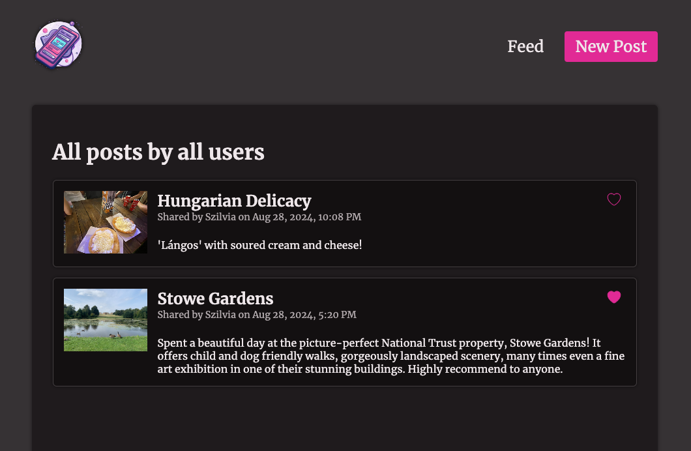
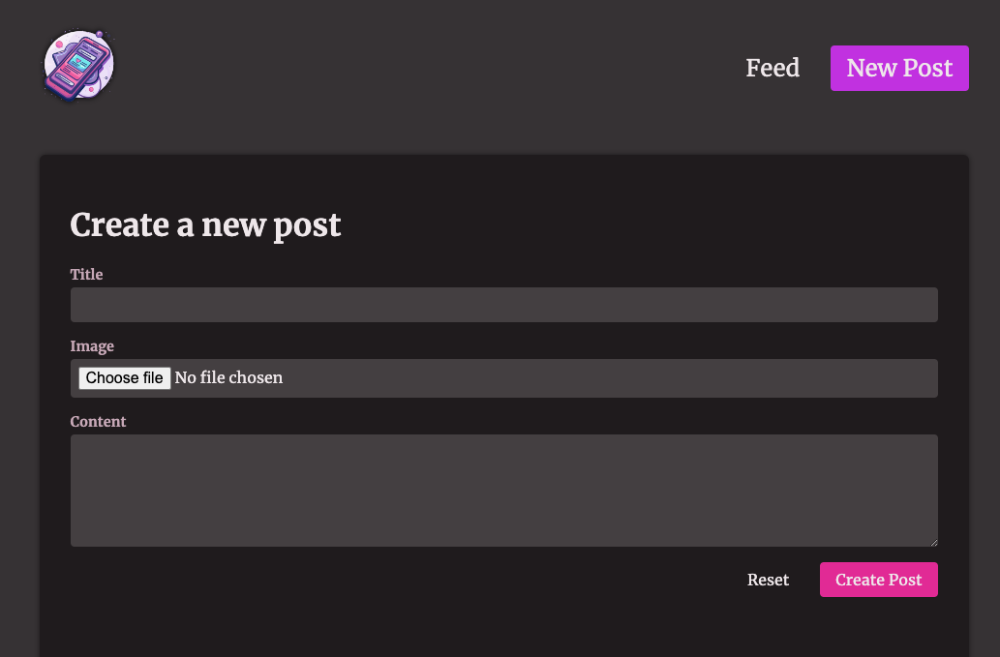

# Post Feed

### Walkthrough Project created as part of [Maximilian Schwarzmüller's Next.js 14 course](https://www.udemy.com/course/nextjs-react-the-complete-guide/), showcasing data manipulation (inc. optimistic component updates), image optimisataion and metadata settings.






This is a [Next.js](https://nextjs.org/) project bootstrapped with [`create-next-app`](https://github.com/vercel/next.js/tree/canary/packages/create-next-app).

## How to run the project

First, use or create a cloudinary account and add your credentialt to a local `env.local` file:
```
CLOUDINARY_CLOUD_NAME=
CLOUDINARY_API_KEY=
CLOUDINARY_API_SECRET=
```

Then, clone the project then run the development server:

```bash
npm run dev
# or
yarn dev
# or
pnpm dev
# or
bun dev
```

Open [http://localhost:3000](http://localhost:3000) with your browser to see the result.